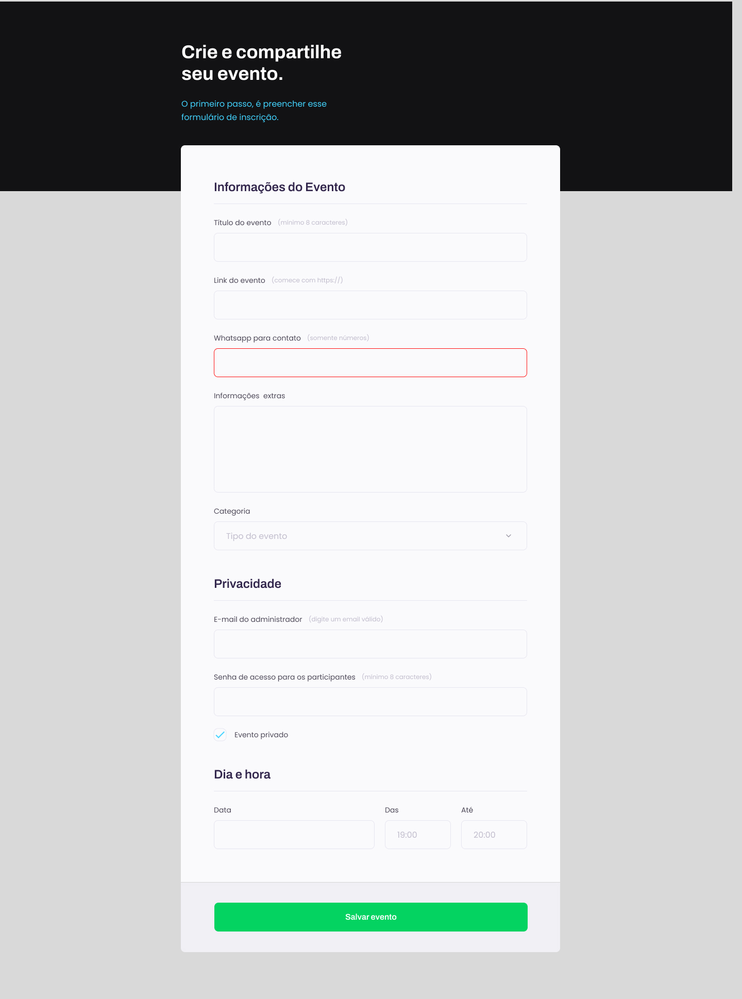

  

  

## 🖥️ Projeto
Esse é um projeto web de um modelo de formulário de cadastro para criação e compartilhamento de eventos.

## 🚀 Tecnologias
Esse projeto foi desenvolvido durante o curos de Explore da Rocketsat com as seguintes tecnologias:

- HTML
- CSS
- GIT E GITHUB

## 🏷️layout
Você pode visualizar o layout do projeto através 
[desse link](https://www.figma.com/file/cCNsBNVsVeiGlnNNo5ABuH/Explorer-Stage-03-Projeto-01-(Copy)?type=design&node-id=1-28&t=NUhULTkJ0PRaRDMl-0).
É necessario ter uma conta no [Figma](https://www.figma.com).